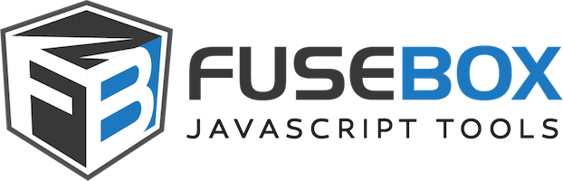

[](https://travis-ci.org/fuse-box/fuse-box)
[](#backers) [](#sponsors)
[](https://gitter.im/fusebox-bundler/Lobby)


[](https://nodei.co/npm/fuse-box/)


# FuseBox
http://fuse-box.org/

FuseBox is a bundler/module loader that combines the power of webpack, JSPM and SystemJS. 

It is blazing fast (it takes 50-100ms to re-bundle) which makes it extremely convenient for developers. It requires zero configuration to bundle such monsters like `babel-core`.

FuseBox loves __typescript__, and does not require any additional configuration. It will compile and bundle your code within a fraction of a second, yet offering a comprehensive loader API. It is packed with features, and unfolds limitless possibilities of extending the API.


Follow us on [twitter](https://twitter.com/FuseBoxJS)


## Backers

Support us with a monthly donation and help us continue our activities. [[Become a backer](https://opencollective.com/fuse-box#backer)]

<a href="https://opencollective.com/fuse-box/backer/0/website" target="_blank"></a>
<a href="https://opencollective.com/fuse-box/backer/1/website" target="_blank"></a>
<a href="https://opencollective.com/fuse-box/backer/2/website" target="_blank"></a>
<a href="https://opencollective.com/fuse-box/backer/3/website" target="_blank"></a>
<a href="https://opencollective.com/fuse-box/backer/4/website" target="_blank"></a>
<a href="https://opencollective.com/fuse-box/backer/5/website" target="_blank"></a>
<a href="https://opencollective.com/fuse-box/backer/6/website" target="_blank"></a>
<a href="https://opencollective.com/fuse-box/backer/7/website" target="_blank"></a>
<a href="https://opencollective.com/fuse-box/backer/8/website" target="_blank"></a>
<a href="https://opencollective.com/fuse-box/backer/9/website" target="_blank"></a>
<a href="https://opencollective.com/fuse-box/backer/10/website" target="_blank"></a>
<a href="https://opencollective.com/fuse-box/backer/11/website" target="_blank"></a>
<a href="https://opencollective.com/fuse-box/backer/12/website" target="_blank"></a>
<a href="https://opencollective.com/fuse-box/backer/13/website" target="_blank"></a>
<a href="https://opencollective.com/fuse-box/backer/14/website" target="_blank"></a>
<a href="https://opencollective.com/fuse-box/backer/15/website" target="_blank"></a>
<a href="https://opencollective.com/fuse-box/backer/16/website" target="_blank"></a>
<a href="https://opencollective.com/fuse-box/backer/17/website" target="_blank"></a>
<a href="https://opencollective.com/fuse-box/backer/18/website" target="_blank"></a>
<a href="https://opencollective.com/fuse-box/backer/19/website" target="_blank"></a>
<a href="https://opencollective.com/fuse-box/backer/20/website" target="_blank"></a>
<a href="https://opencollective.com/fuse-box/backer/21/website" target="_blank"></a>
<a href="https://opencollective.com/fuse-box/backer/22/website" target="_blank"></a>
<a href="https://opencollective.com/fuse-box/backer/23/website" target="_blank"></a>
<a href="https://opencollective.com/fuse-box/backer/24/website" target="_blank"></a>
<a href="https://opencollective.com/fuse-box/backer/25/website" target="_blank"></a>
<a href="https://opencollective.com/fuse-box/backer/26/website" target="_blank"></a>
<a href="https://opencollective.com/fuse-box/backer/27/website" target="_blank"></a>
<a href="https://opencollective.com/fuse-box/backer/28/website" target="_blank"></a>
<a href="https://opencollective.com/fuse-box/backer/29/website" target="_blank"></a>


## Sponsors

Become a sponsor and get your logo on our README on Github with a link to your site. [[Become a sponsor](https://opencollective.com/fuse-box#sponsor)]

<a href="https://opencollective.com/fuse-box/sponsor/0/website" target="_blank"></a>
<a href="https://opencollective.com/fuse-box/sponsor/1/website" target="_blank"></a>
<a href="https://opencollective.com/fuse-box/sponsor/2/website" target="_blank"></a>
<a href="https://opencollective.com/fuse-box/sponsor/3/website" target="_blank"></a>
<a href="https://opencollective.com/fuse-box/sponsor/4/website" target="_blank"></a>
<a href="https://opencollective.com/fuse-box/sponsor/5/website" target="_blank"></a>
<a href="https://opencollective.com/fuse-box/sponsor/6/website" target="_blank"></a>
<a href="https://opencollective.com/fuse-box/sponsor/7/website" target="_blank"></a>
<a href="https://opencollective.com/fuse-box/sponsor/8/website" target="_blank"></a>
<a href="https://opencollective.com/fuse-box/sponsor/9/website" target="_blank"></a>


You have created an awesome plugin? Add it to the [list](https://github.com/fuse-box/fuse-box/blob/master/docs/third-party-plugins.md)


- [Official Documentation](http://fuse-box.org/)
- [Submit an Issue](https://github.com/fuse-box/fuse-box/issues/new)
- [Make Documentation Better](https://github.com/fuse-box/fuse-box/tree/master/docs)
- [Join Gitter Channel](https://gitter.im/fusebox-bundler/Lobby) (we are active!)


## Installation

FuseBox has many plugins in place to help you get started. All you need to do is install `fuse-box` from npm or yarn.

```bash
npm install fuse-box --save-dev
yarn add fuse-box --dev
```

## Try it out!

### [Angular2 Example](https://github.com/fuse-box/angular2-example)

Todo App built on the latest Angular2 (compiles in 50-80ms!)

### [React Example](https://github.com/fuse-box/react-example)

Simple example using React with babel (compiles in 50ms!)

## Highlights

* No headache, minimal configuration
* First class [typescript](http://fuse-box.org/page/typescript) support
* Tree shaking
* [Arithmetic instructions](http://fuse-box.org/page/bundle#arithmetic-instructions)
* Blazing fast bundle time
* [Wildcard imports](http://fuse-box.org/page/loader-api#wildcard-import)
* [Dynamic modules](http://fuse-box.org/page/loader-api#dynamic-modules) at runtime
* [Tilde support](http://fuse-box.org/page/loader-api#point-to-the-root)
* [DevServer and HMR](http://fuse-box.org/page/development) integrate with existing HTTP apps in 1 second!
* Metadata e.g `__filename` for decorators.
* Works everywhere for easy universal applications!

There is so much more. FuseBox pushing it to a whole new level!

## Start Now

```bash
npm install typescript fuse-box --save-dev
```

```ts
const { FuseBox } = require("fuse-box");
const fuse = FuseBox.init({
    homeDir: "src",
    output: "dist/$name.js",
});
fuse.bundle("app")
    .instructions(`>index.ts`);

fuse.run();
```

## [Examples and seeds](http://fuse-box.org:3333/page/examples-and-seeds)


Join our [gitter channel](https://gitter.im/fusebox-bundler/Lobby) we are very active and friendly!

Special thanks to [devmondo](https://github.com/devmondo) for incredible ideas, giving inspiration and relentless testing/contributing to the project.  

If you like the project, don't forget to star it!
